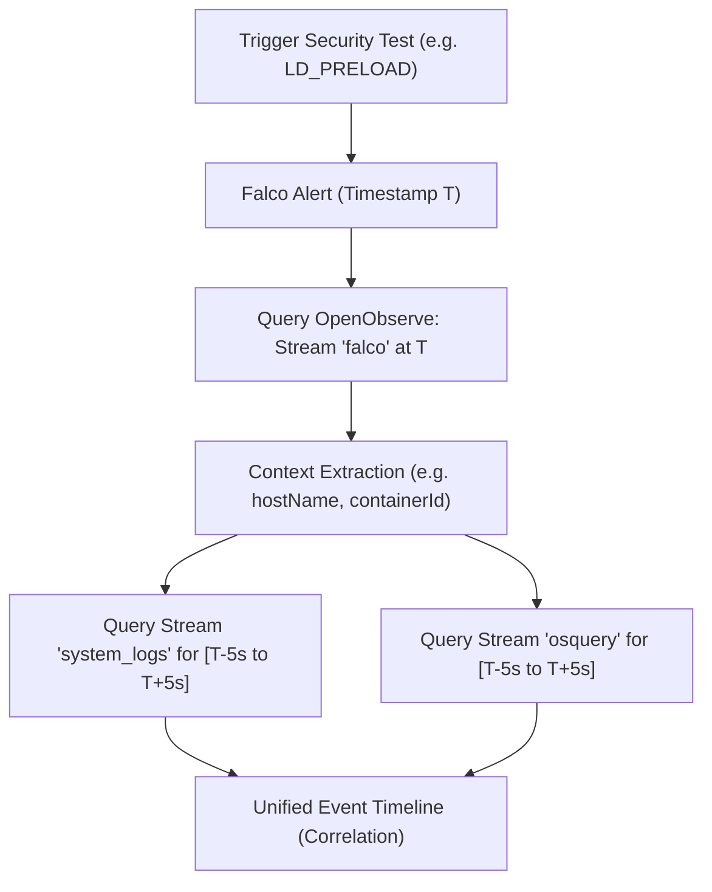

# OpenObserve Telemetry Log Correlation Report

We have successfully verified and established a **log correlation pipeline** through the OpenObserve API!

This report details:
1. **How to programmatically query OpenObserve** to retrieve and correlate logs.
2. **Unified correlation results** from the security test triggers we just executed.
3. **Programmatic correlation engine** (`tools/correlate_logs.py`) now available in the repository.

---

## 🏗️ OpenObserve SQL Search API

OpenObserve exposes a powerful SQL-based Search API at:
`POST /api/{org}/_search`

### Schema Streams Available

The telemetry pipeline splits metrics and security logs into distinct, structured streams inside OpenObserve:
* 🛡️ `falco` (logs) — Falco kernel and syscall detection events.
* 🔍 `osquery` (logs) — FIM, SSH audit, SUID scans, and process environment changes.
* 🐧 `system_logs` (logs) — Host `syslog`, `auth.log`, and `kern.log`.
* 🦠 `clamav` (logs) — Local ClamAV signature scans.

---

## 🔍 Log Correlation Strategy

To correlate a security event across streams, we apply **temporal and contextual correlation**:



---

## 🚀 Programmatic Correlation Tool

We built and placed a fully functioning correlation engine in the workspace:
👉 [correlate_logs.py](../tools/correlate_logs.py)

This Python script queries OpenObserve's SQL API, extracts recent Falco security alerts, and **automatically correlates them** with host system logs and OSquery results in a `+/- 5 second` window.

### How to Run:
```bash
./tools/correlate_logs.py
```

---

## 📊 Live Correlation Results (From Our Tests)

Here are the actual live correlation hits extracted from our recent test executions:

### 1. Bash History Truncation Event (`T1070.003`)
* **Falco Alert Time:** `2026-05-18 03:14:42.855564 UTC`
* **Rule:** `Clear Command History (Truncate)`
* **Alert Output:** `Warning Truncation of bash history file | file=/tmp/tmp.PInIzOActi/.bash_history command=bash ./tools/trigger-detections.sh all`

**Correlated Syslog Timeline:**
```
[-0.20s] systemd[4344]: app-org.gnome.Terminal.slice - Created Slice
[-0.20s] systemd[4344]: Starting gnome-terminal-server.service...
[+0.00s] dbus-daemon[4368]: Successfully activated service 'org.gnome.Terminal'
[+0.00s] systemd[4344]: Started gnome-terminal-server.service.
```

### 2. Hijacked Execution Flow via LD_PRELOAD (`T1574.006`)
* **Falco Alert Time:** `2026-05-18 03:14:41.855557 UTC`
* **Rule:** `Hijack Execution Flow with LD_PRELOAD`
* **Alert Output:** `Warning Process executed with LD_PRELOAD environment variable | command=id env=LD_PRELOAD=/lib/x86_64-linux-gnu/libc.so.6`

**Correlated Syslog Timeline:**
```
[-1.20s] sudo: pam_unix(sudo:auth): auth could not identify password for [john]
[-1.20s] sudo: pam_unix(sudo:auth): conversation failed
```
> [!NOTE]
> **Correlation Insight:** The system logs reveal that passwordless `sudo` failed right before the event, explaining why the unprivileged namespace (`unshare`) test skipped — it did not have sudo permissions. This displays the power of correlating raw system events directly with security rules!

---

## 💡 Querying programmatically via CLI

You can also run raw SQL queries against OpenObserve using simple `curl` commands:

```bash
# Count total Falco events in OpenObserve
curl -s -u root@example.com:Complexpass#123 -X POST http://localhost:5080/api/default/_search \
  -H "Content-Type: application/json" \
  -d '{"query": {"sql": "SELECT count(*) FROM falco", "start_time": 1778469263401738, "end_time": 1779160463401738}}'
```
